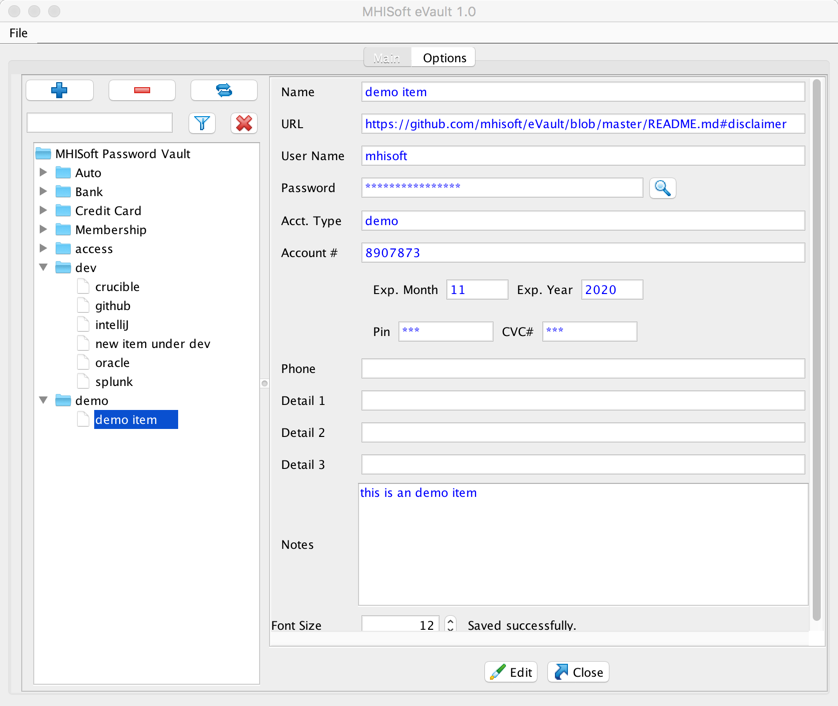

#MHISoft eVault - A Secure Password Manager and  Vault

I just don't trust any online or third party vault for storing my personal information and passwords.  So I created this open source.

It is a secure password vault which is best suitable for storing passwords and personal data.  All the data are stored in a encrypted dtabase with AES 256 bit key  encryption. You only need to remember one master password and a set of combination code to the vault. The password is stored in a hashed format and can't be reverse engineered.  The app runs offline so you don't need to worry about data being transmitted over the network.  

The password once lost can't be recovered by design. The author of this code can't even recover the lost password. And without the password and combination, the vault can't be opened, thus the data in the vault will be lost. 

#Features
* Free. 
* Runs offline.
* Super fast. 
* Platform: Windows and Mac OS X...etc where Java  is supported. 
* Organize  passwords with categories.  
* Search the entire wallet and locate the item you need instantly. 
* Support multiple data files. 
* Support Import and merge in changes from another data file. 
* Auto close the vault if idling for too long.

# Some technical details

*  The JRE is bundled with the release so there is no extra step to install the JRE or  the  “Java Cryptography Extension (JCE) Unlimited Strength Jurisdiction Policy” .  

* All the data are stored locally, encrypted. By default, it uses the PBEWithHmacSHA512AndAES_256 algorithm, 256 bit key encryption which is considered very safe. 
 
* Password is stored in the most secured Hash format. In theory the password can't be reverse engineered from this hash , not under the current human technology. Random salted hashing with the  PBKDF2WithHmacSHA512 algorithm is used.   More tech details please see  https://crackstation.net/hashing-security.htm for more information.

* Runs offline. No network connection required, neither is it used by the app. 
 While using other similar product which connects to the network, I have always been worried about the data could be secretly transmitted to somewhere across the network without my knowledge.  The MHISoft eWallet does not use any network activity of any sort. It does not open network port (TCP ports) or use http.  Thus it definitely will not transmit any data over the network. 
 
## Disclaimer
The author is not responsible for loss of any kind incurred directly or indirectly by using this application.

## License
Apache License 2.0, January 2004 http://www.apache.org/licenses/

